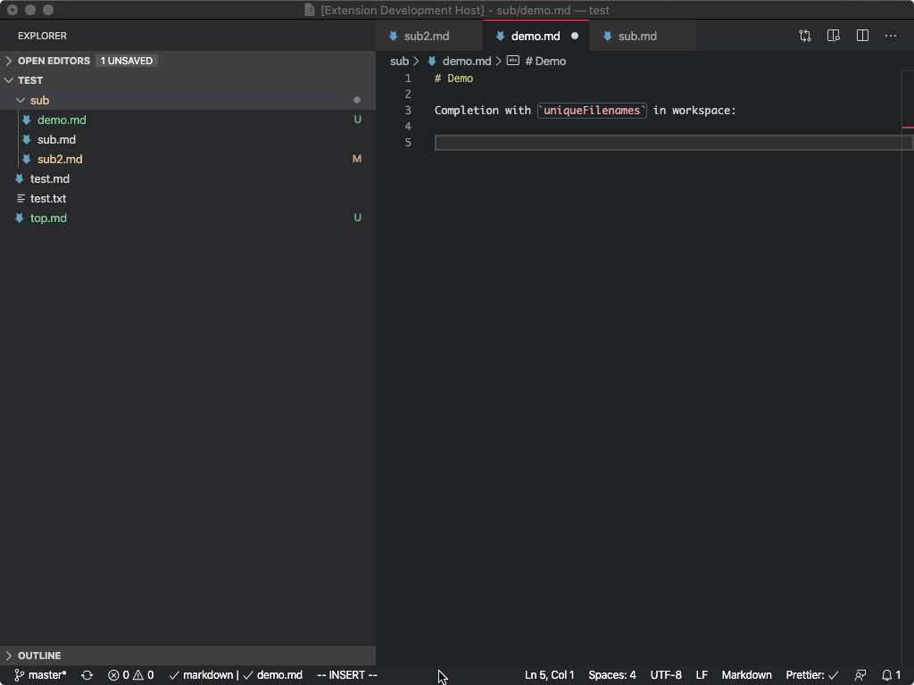
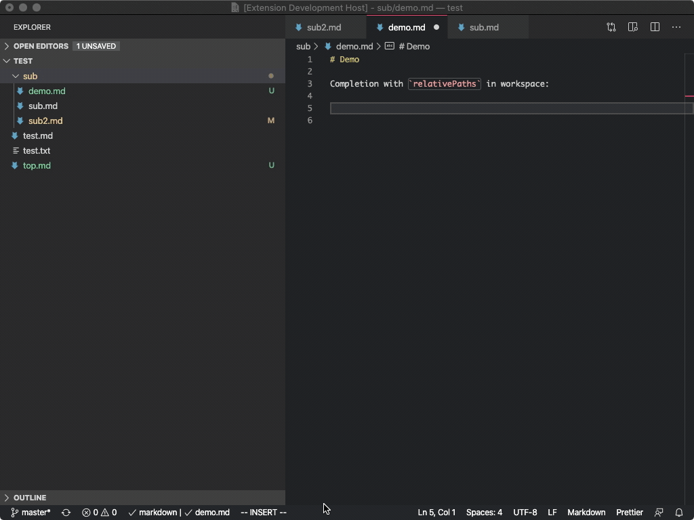
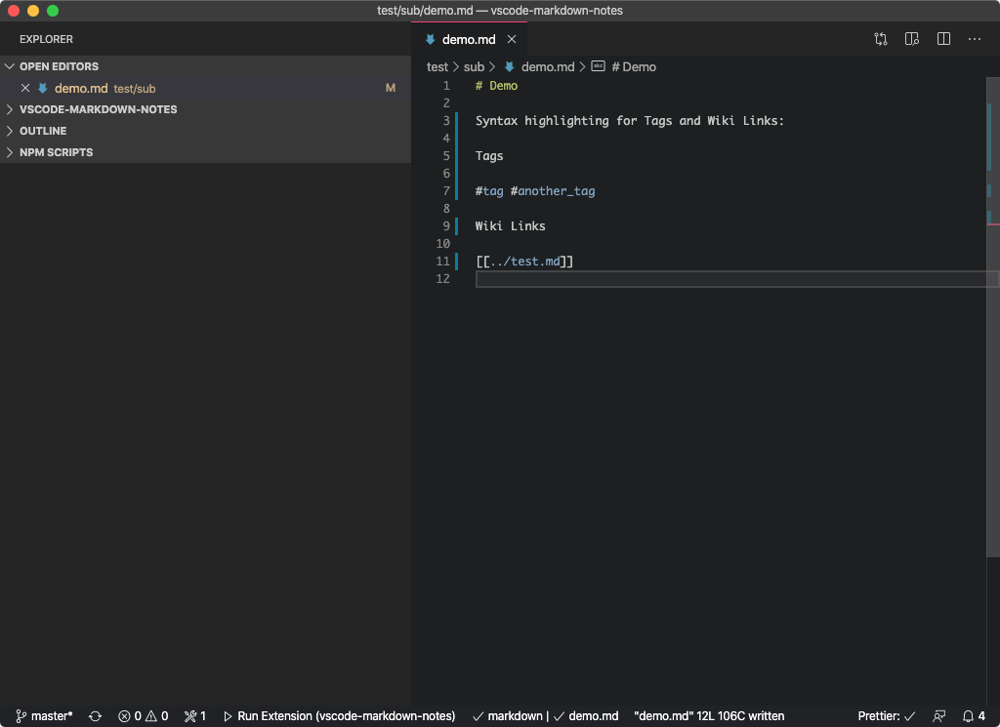
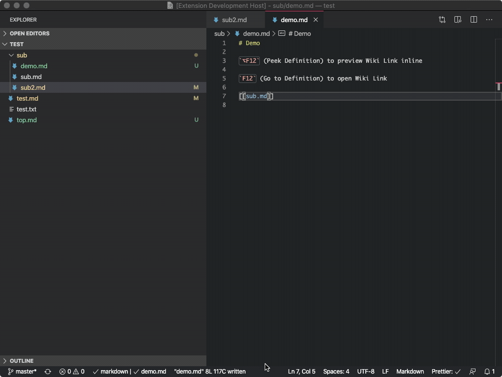

# VS Code Markdown Notes

Use `[[wiki-links]]` and `#tags` for fast-navigation between notes kept in in a VS Code workspace. Quickly create new notes from a Title Case Note Name.

There are many great note-taking applications ([Notational Velocity](http://notational.net/), [nvalt](https://brettterpstra.com/projects/nvalt/), [Bear](https://bear.app/), [FSNotes](https://fsnot.es/)), but few of them offer the extensibility of VS Code and the ability to use Vim bindings for editing notes.

This extension provides a number of the best features invented by these other great apps.

You can [install it from the VSCode Marketplace](https://marketplace.visualstudio.com/items?itemName=kortina.vscode-markdown-notes). See also my other customizations for note-taking in this blog post: [Suping Up VS Code as a Markdown Notebook](https://kortina.nyc/essays/suping-up-vs-code-as-a-markdown-notebook/).

### `[[wiki-links]]`

A popular feature in [Roam Research](https://roamresearch.com/) and [Bear](https://bear.app/) is the ability to quickly reference other notes using "Cross-Note Links" in the `[[wiki-link]]` style.

VS Code Markdown notes provides syntax highlighting, auto-complete, Go to Definition (`editor.action.revealDefinition`), and Peek Definition (`editor.action.peekDefinition`) support for wiki-links to notes in a workspace.

By default, the extension assumes each markdown file in a workspace has a unique name, so that `note.md` will resolve to the file with this name, regardless of whether or not this file exists in any subdirectory path. This tends to be a bit cleaner, but if you want support for multiple files with the same name, in `settings.json` set `"vscodeMarkdownNotes.workspaceFilenameConvention": "relativePaths"`, and you'll get completions like `note1/note.md` and `../note2/note.md`.

### #tags

Syntax highlighting for `#tags`.

### New Note command

Provides a command for quickly creating a new note.

You can bind this to a keyboard shortcut by adding to your `keybindings.json`:

```json
    {
        "key": "al+shift+n",
        "command": "vscodeMarkdownNotes.newNote",
    },
```

### Screenshots

#### Intellisense Completion for Wiki Links, `uniqueFilenames`



#### Intellisense Completion for Wiki Links, `relativePaths`



#### Syntax Highlighting for Tags and Wiki Links



#### Peek and Go to Definition for Wiki Links



#### `cmd+shift+f` to Search Workspace for Notes with #tag


#### New Note Command


## dev

Run `npm install` first.

### FAQ

- "Autocomplete / Intellisense is not working - why?"
  - Quick suggestions are not enabled by default in Markdown, so you have to manually  `triggerSuggest` OR put this in settings.json:
  ```
  "[markdown]": {
     "editor.quickSuggestions": true
  }
  ```
- "New note is not working - why?"
  - New Note works only when you are in a workspace. Look [here](https://stackoverflow.com/questions/44629890/what-is-a-workspace-in-visual-studio-code) for more information on workspaces in VS Code.

### Known Issues

- The `ctrl+o` VSCodeVim jumplist shortcut does not return you to the correct place after using "Go to Definition" (`ctrl+]`): https://github.com/VSCodeVim/Vim/issues/3277 (The VSCode `Go Back` command (`ctrl+-`) does work, however.)
- This extension sets the `wordPattern` for 'markdown' in order to (1) enable proper completion of relative paths and (2) make it such that if you `cmd+shift+f` on a `#tag` the search will prefill with "#tag" and not just "tag":
  <br />`vscode.languages.setLanguageConfiguration('markdown', { wordPattern: /([\#\.\/\\\w_]+)/ });`

### TODO

- Add command to create file based on name in the wiki-link under the cursor
- Add command to create new note with name + heading
- Provide better support for ignore patterns, eg, don't complete `file.md` if it is within `ignored_dir/`
- Should we support filename without extension, eg, assume `[[file]]` is a reference to `file.md`?
- Should we support links to headings? eg, `file.md#heading-text`?

### Development and Release

To create a new release,

```sh
npm install
# bump version number in package.json
npm run vpackage # package the release, creates vsix
npm run vpublish # publish to store, see https://code.visualstudio.com/api/working-with-extensions/publishing-extension
# Will prompt for Azure Devops Personal Access Token, get fresh one at:
# https://dev.azure.com/andrewkortina/
# On "Error: Failed Request: Unauthorized(401)"
# see: https://github.com/Microsoft/vscode-vsce/issues/11
# The reason for returning 401 was that I didn't set the Accounts setting to all accessible accounts.
```

To install the `vsix` locally:

1. Select Extensions `(Ctrl + Shift + X)`
2. Open `More Action` menu (ellipsis on the top) and click `Install from VSIX…`
3. Locate VSIX file and select.
4. Reload VSCode.

###### Helpful Links

- completion: https://github.com/microsoft/vscode-extension-samples/blob/master/completions-sample/src/extension.ts
- syntax: https://flight-manual.atom.io/hacking-atom/sections/creating-a-legacy-textmate-grammar/
- vscode syntax: https://code.visualstudio.com/api/language-extensions/syntax-highlight-guide
